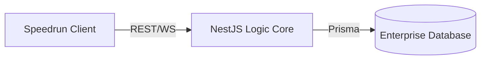

<p align="center">
  
</p>

# 🚀 Speedrun Delivery

[](https://nestjs.com/)
[](https://reactjs.org/)
[](https://www.prisma.io/)
[](https://tailwindcss.com/)
[](https://www.typescriptlang.org/)

> **"Entregas Evolucionadas. Solo Excelencia."**
> Logística de alto rendimiento para quienes valoran el tiempo. Sin fricciones, sin retrasos.

---

## ✨ La Experiencia Speedrun

**Speedrun Delivery** reinventa la logística de última milla con un enfoque en la velocidad y la transparencia. Nuestra plataforma ofrece una infraestructura de clase mundial diseñada para operar en tiempo real.

- **Fricción Cero**: Interfaz minimalista diseñada para la eficiencia operativa máxima.
- **Sincronización Atómica**: Cada actualización de estado se propaga instantáneamente a todos los interesados.
- **Negociación Fluid**: Sistema bidireccional de ofertas que permite acuerdos rápidos y justos.
- **Evidencia Instantánea**: Sistema optimizado de carga de fotos para validación inmediata de entregas.

---

## 🎨 Estética de Alto Rendimiento

El sistema visual de **Speedrun Delivery** se centra en la claridad y el minimalismo premium:

- **Contraste Extremo**: El fondo negro profundo permite una legibilidad superior de los indicadores críticos.
- **HUD Glassmorphism**: Componentes con capas translúcidas que proporcionan profundidad sin distraer al usuario.
- **Animaciones Fluidas**: Micro-interacciones suaves que guían al usuario a través del flujo de entrega.
- **Atmósfera Dinámica**: Efectos visuales sutiles que aportan una sensación de tecnología viva y activa.

---

## 🛠️ Stack Tecnológico

Construido con las tecnologías más modernas para garantizar estabilidad y escalabilidad:

| Componente | Tecnología |
| :--- | :--- |
| **Arquitectura** | Monorepo (Frontend + Backend) |
| **Backend** | NestJS (Type-safe & Scalable) |
| **Frontend** | React + Vite (Ultra-fast Rendering) |
| **Base de Datos** | Prisma ORM + MSSQL (Data Reliability) |
| **Comunicación** | Socket.io (Low-latency WebSockets) |
| **Estructura** | Tailwind CSS (Design System Consistency) |

---

## 🏗️ Arquitectura de Datos



---

## 📂 Configuración del Repositorio

```bash
├── sd-backend/       # Lógica de Negocio y API
├── sd-frontend/      # Dashboard y Landing Page
└── README.md         # Documentación Central
```

---

<p align="center">
  <strong>Speedrun Delivery</strong> | Logística Evolucionada.
</p>
