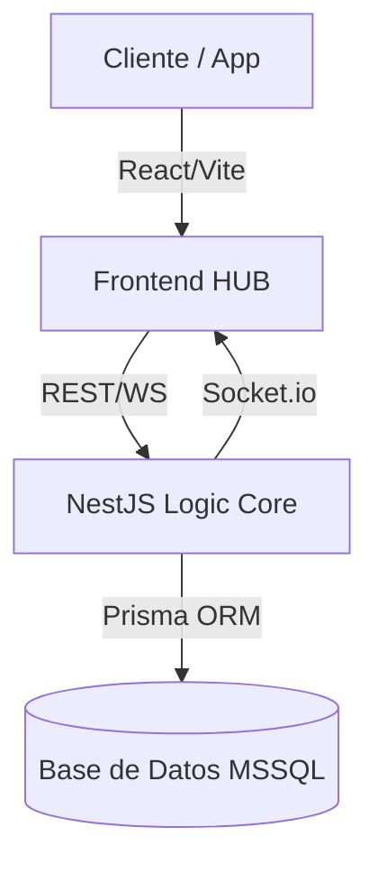

# 🌑 Speedrun Delivery: Sober Obsidian

[](https://nestjs.com/)
[](https://reactjs.org/)
[](https://www.prisma.io/)
[](https://tailwindcss.com/)
[](https://www.typescriptlang.org/)

**Speedrun Delivery** es una plataforma de logística de alto rendimiento diseñada bajo la estética **Sober Obsidian**. Un sistema sin fricciones, sin retrasos y enfocado en la excelencia operativa.

---

## ✨ Características Principales

- **Interfaz Sober Obsidian**: Fondo negro puro (`#050505`) con tipografía de alto contraste y efectos de "Glassmorphism" premium.
- **Sincronización en Tiempo Real**: Seguimiento de pedidos en vivo mediante WebSockets (Socket.io).
- **Flujo de Negociación Avanzado**: Sistema de invitaciones directas con soporte para contra-ofertas.
- **Evidencia Digital**: Sistema de carga de fotos (Base64) para comprobantes de entrega instantáneos.
- **Arquitectura Escalable**: Estructura de monorepositorio con backend en NestJS y frontend en React/Vite.

---

## 🏗️ Arquitectura del Sistema



---

## 📂 Estructura del Proyecto

```bash
├── sd-backend/       # Servidor NestJS (Lógica de Negocio, Socket.io, JWT)
├── sd-frontend/      # Dashboard React (Tailwind, Framer Motion)
└── README.md         # Documentación Principal
```

---

## 🛠️ Configuración Rápida

### 1. Requisitos Previos
- Node.js v18+
- Una instancia de base de datos SQL Server (MSSQL)

### 2. Configuración del Backend
```bash
cd sd-backend
npm install
cp .env.example .env
# Configura tu DATABASE_URL en .env
npx prisma generate
npx prisma migrate dev
npm run start:dev
```

### 3. Configuración del Frontend
```bash
cd sd-frontend
npm install
cp .env.example .env
# Configura tu VITE_API_URL en .env
npm run dev
```


---

## 🌑 Lineamientos Estéticos

Este proyecto utiliza el sistema de diseño **Sober Obsidian**:
- **Fondo**: `#050505` (Obsidian Black)
- **Acentos**: Blanco puro y escala de grises premium.
- **Efectos**: Sombras suaves, bordes sutiles y animaciones fluidas con Framer Motion.

---

## 📝 Licencia

Distribuido bajo la Licencia MIT. Consulta `LICENSE` para más información.

<p align="center">
  Logística Evolucionada. Solo Excelencia.
</p>
